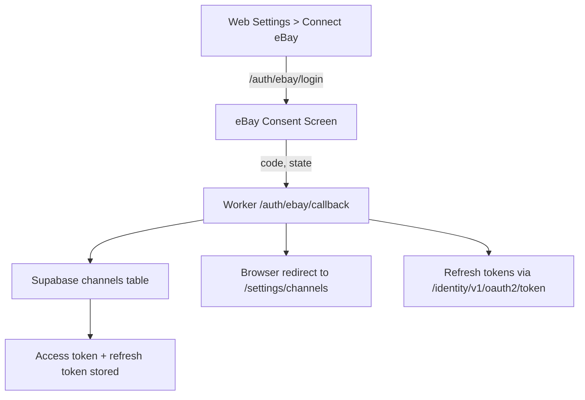

# eBay OAuth Overview

## Endpoints

| Path | Method | Description |
| ---- | ------ | ----------- |
| `/auth/ebay/login` | GET | Redirects user to eBay OAuth using tenant-scoped state. |
| `/auth/ebay/callback` | GET | Exchanges code for tokens and persists them in `channels`. |
| `/listings/ebay/publish` | POST | Publishes (or dry-runs) listing syncs; logs `job_events`. |
| `/listings/ebay/draft` | POST | Creates a simulated draft payload and logs `job_events`. |
| `/ext/demoPayload` | GET | Returns the demo payload consumed by the browser extension. |
